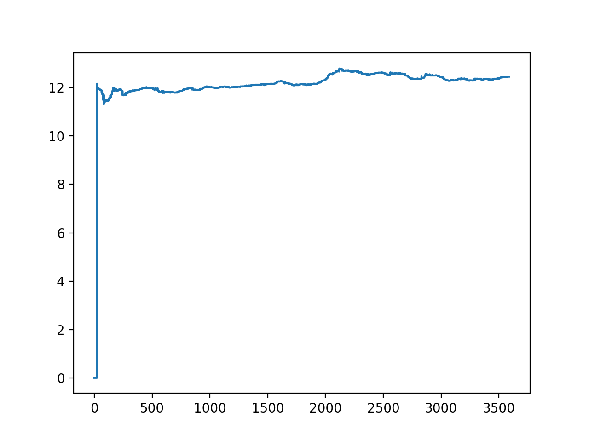
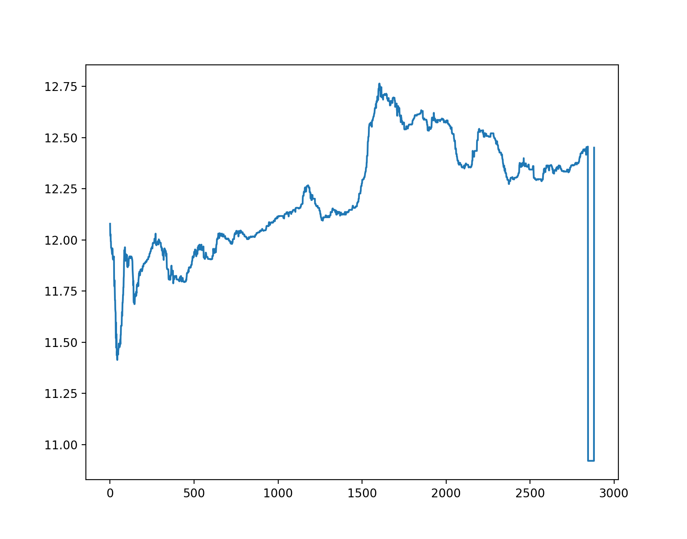

# 
模式识别报告 

黄宇飞 2016011259

## 实验成果

本次实验通过使用多层神经网络的方法，对每天的股票的原始数据进行了训练，并在一些数据中进行了股票价格的预测。

## 数据的预处理

本次大作业提供了很多的数据文件，记录了每天的股票交易数据，对于之前没有过炒股经验我们来说如何读懂其中的数据也是一件很复杂的事情。通过仔细阅读助教的文档和在网上搜来的股票市场介绍，决定对数据进行如下方式的预处理。

1. 价格的计算

Tick文件夹中不同的文件对应时间或股票ID不同的股票在某一天的交易情况，其中给出了很小时间间隔内的交易数据，但给出的数据中的nPrice序列并不是很准确，同时不同的相邻数据之间的时间间隔并不确定，我们可视化某个文件的nPrice的结果如下：

可以看到该价格变化几乎没有起伏，所以需要我们使用助教提供的方法重新计算了价格，计算的公式为

$P_{dt}(t) = k \times \frac{iAccTurover(t) - iAccTurover(t - dt)}{iAccVolume(t) - iAccVolume(t-dt)} + (1 - k) \times \frac{nBidPrice(t)[0] + nAskPrice(t)[0]}{2}$

其中$dt$为一段很小的时间间隔，$k$为参数，我们取的为0.3，其中的股票术语分别为：

+ $iAccTurover(t)$ 当天时间t之前的累计交易额
+ $iAccVolume(t)$ 当天时间t之前的累积交易量
+ $nBidPrice(t)$ 当天时间t的买家出价，为一个 list，这里取第一个（最大值）
+ $nAskPrice(t)$ 当天时间t的卖家要价，为一个list，这里取第一个（最小值）

另外 一点需要注意的是$nBidPrice$和$nAskPrice$与通过$iAccTurover$和$iAccVolume$算出来的价格单位不同，需要把$nBidPrice$和 $nAskPrice$除以10000使单位相同.

2.  时间等间隔化

由于给出的数据中，时间也并没有按照等间隔的给出，同时每天股市的交易时间为上午9:30-11:30以及下午13:00到15:00，所以需要在这些时间中等间隔的得到每个时刻的价格数据，这里对于没有正好在两个时刻中间的数据点，使用线性插值的方法从上下两个相距最近的点得到该时刻的值。通过这样的方法得到某只股票某一天从每天早上9:29:55，每隔5s时间，直到11:30的数据点以及从下午13:00，每隔5s的时间到15:00的数据点的数据，共有2883个点。再通过上述的价格计算公式得到2882个价格组成的序列作为我们最终的训练和测试数据。我们将处理中之后的结果进行可视化，结果如下：

数据预处理的代码部分都在`reader.py`文件中，主要过程由`Reader.read_tick()`函数实现，其处理好的数据会保存在原数据文件目录下的`HandleTick`文件夹中。

