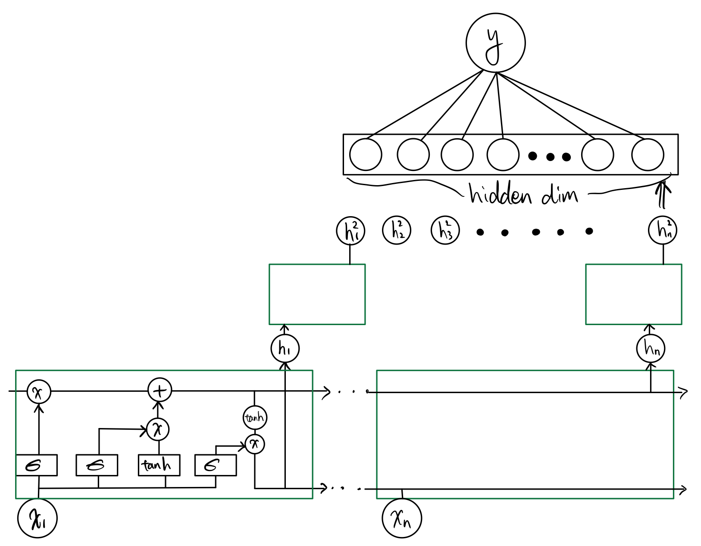
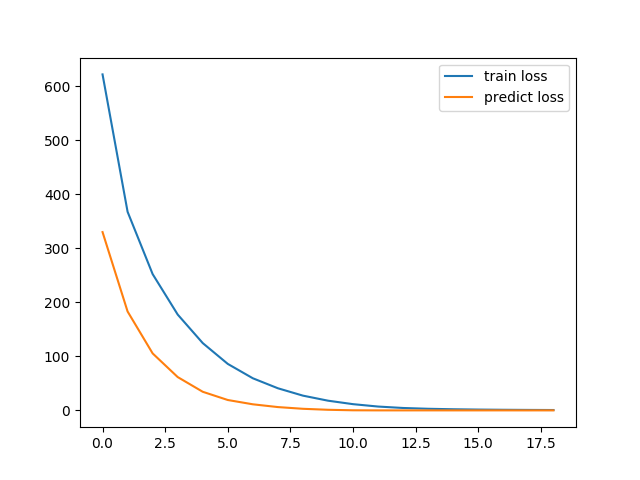
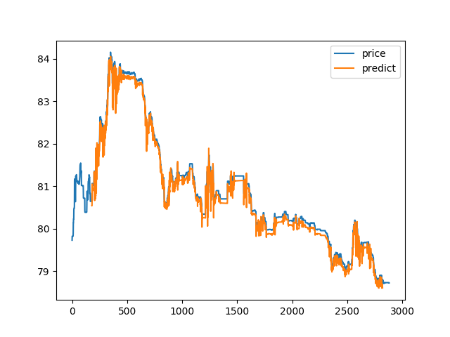
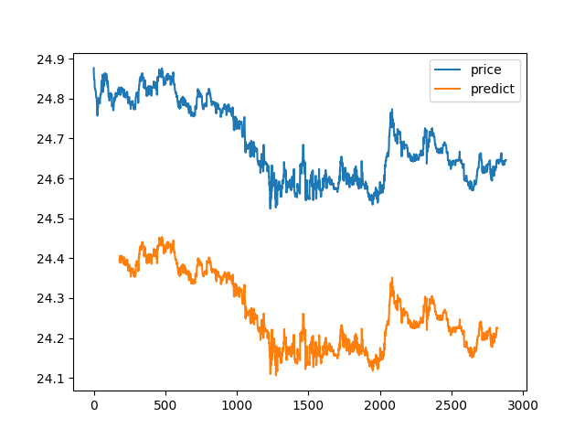

# 
模式识别报告 

黄宇飞 2016011259

金在源 2016080035

## 0 实验目标

本次实验通过使用多层神经网络的方法，对每天的股票的原始数据进行了训练，并在一些数据中进行了股票价格的预测。最终预测未来(0.5min, 5min)后价格的上涨和下跌的平均准确率为**37.96%**，上涨和下跌的平均召回率为**50.03%**。

## 1 数据的预处理

本次大作业提供了很多的数据文件，记录了每天的股票交易数据，对于之前没有过炒股经验我们来说如何读懂其中的数据也是一件很复杂的事情。通过仔细阅读助教的文档和在网上搜来的股票市场介绍，决定对数据进行如下方式的预处理。

### 1.1 价格的计算

Tick文件夹中不同的文件对应时间或股票ID不同的股票在某一天的交易情况，其中给出了很小时间间隔内的交易数据，但给出的数据中的nPrice序列并不是很准确，其代表着官方的价格，但具体股票市场的价格也和股票的供需有关，同时不同的相邻数据之间的时间间隔并不确定，所以我们需要重新计算价格。我们可视化某个文件的nPrice的结果如下：

可以看到该价格变化几乎没有起伏。我们决定使用助教提供的方法重新计算了价格，计算的公式为

$P_{dt}(t) = k \times \frac{iAccTurover(t) - iAccTurover(t - dt)}{iAccVolume(t) - iAccVolume(t-dt)} + (1 - k) \times \frac{nBidPrice(t)[0] + nAskPrice(t)[0]}{2}$

其中$dt$为一段很小的时间间隔，$k$为参数，我们取的为0.3，其中的股票术语分别为：

+ $iAccTurover(t)$ 当天时间t之前的累计交易额
+ $iAccVolume(t)$ 当天时间t之前的累积交易量
+ $nBidPrice(t)$ 当天时间t的买家出价，为一个 list，这里取第一个（最大值）
+ $nAskPrice(t)$ 当天时间t的卖家要价，为一个list，这里取第一个（最小值）

另外 一点需要注意的是$nBidPrice$和$nAskPrice$与通过$iAccTurover$和$iAccVolume$算出来的价格单位不同，需要把$nBidPrice$和 $nAskPrice$除以10000使单位相同.

### 1.2 时间等间隔化

由于给出的数据中，时间也并没有按照等间隔的给出，同时每天股市的交易时间为上午9:30-11:30以及下午13:00到15:00，所以需要在这些时间中等间隔的得到每个时刻的价格数据，这里对于处在两个数据点中间的数据点，使用线性插值的方法从上下两个相距最近的点得到该时刻的值。通过这样的方法得到某只股票某一天从每天早上9:29:55，每隔5s时间，直到11:30的数据点以及从下午13:00，每隔5s的时间到15:00的数据点的数据，共有2883个点。再通过上述的价格计算公式得到2882个价格组成的序列作为我们最终的训练和测试数据。我们将处理中之后的结果进行可视化，结果如下：

可以看到这个结果可以更好的反映一天内某支股票实际交易价格的波动，最后一个突然下跌的点是由于突然没有人对该股票出价造成的，这个现象也是合理的，当某支股票没有人出价时，其实际价值就需要有所折扣。

数据预处理的代码部分都在`reader.py`文件中，主要过程由`Reader.read_tick()`函数实现，其处理好的数据会保存在原数据文件目录下的`HandleTick`文件夹中。

## 2 模型设计

本次大作业中，本组采用**单向双层LSTM**模型+**1层全连接层**来预测价格。

首先采用LSTM的原因是LSTM可以很好的处理时间序列，而采用双层的原因是由于价格序列每个数据都是一维，首先通过一维LSTM进行扩维，以更好的抓取每个价格中隐含的信息，然后再通过第二层的LSTM对序列的含义进行抽象，最后通过最后一维的输出就可以通过全连接层进行预测。

## 3 实验设计

### 3.1 数据划分

以一个`id`的股票**一天**的数据为单位：

将总数据集划分成**训练集**，**验证集**，**测试集**。比例为：$$0.8:0.1:0.1$$

|              | 下跌   | 不变   | 上涨   |
| ------------ | ------ | ------ | ------ |
| Training set | 28.14% | 45.03% | 28.82% |
| Valid set    | 28.10% | 44.47% | 27.43% |
| Test set     | 28.99% | 43.41% | 27.59% |

### 3.2 训练

1. 将一个`id`的股票的**一天**的数据根据`predict_length`划分。即将数据划分为

   $$\{x|x{\in}Data[i:i+predictlen]\}$$，其中$$i{\in}[0, length-predictlen]$$

   每个数据对应的标签即为$$y{\in}Data[i+predictlen]$$，其中$$i{\in}[0, length-predictlen]$$

2. 将每个`id`的**所有天**的数据并起来，构成总数据集

3. 循环`epoch`次如下操作，进行模型的训练

4. 模型得到输出，即以前`predict_length`个价格预测出来的第`predict_length + 1`个价格，并根据实际的价格求得**均方误差**

5. 根据计算出来的**均方误差**做梯度回传，用**Adam**做优化

6. 在每个`epoch`操作，做**学习率的调整**，即在当前的`learning rate`乘以`learning rate decay factor`，防止模型**过拟合**

### 3.3 验证及测试

1. 取一个`id`的一天的前`predict_length`个价格
2. 预测第*predict* *len* *+ 1*个价格，并一直预测后面b个价格
3. 对第*predict* *len* *+ 1*个价格以未来[*a, b*]的价格进行分类
4. 同理，对数据[*predict* *len*, *max* *len* *- b*)进行预测并分类
5. 计算**精确率**和**召回率**

## 4 实验结果

### 4.1 对比实验

调整如下参数：

* `predict length`
* `hidden size`
* `learning rate`

进行如下对比实验

| Best Epoch | learning rate | predict len | hidden dim | label accuracy | Precision | Recall |
| ---------- | ------------- | ----------- | ---------- | -------------- | --------- | ------ |
| 9          | 0.0001        | 60          | 50         | 28.23%         | 28.10%    | 49.05% |
| 4          | 0.0001        | 60          | 100        | 28.53%         | 29.28%    | 49.70% |
| 6          | 0.0005        | 120         | 50         | 27.54%         | 37.96%    | 50.03% |
| 18         | 0.0001        | 180         | 50         | 28.30%         | 30.27%    | 50.01% |

### 4.2 训练与测试

参数：

* `predict length`=180
* `init learning rate`=0.0001
* `hidden size`=50

### 4.3 预测结果可视化

#### 4.3.1 成功的例子

* 预测轨迹与真实价格轨迹基本吻合
* 部分位置处略微低于原始曲线

#### 4.3.2 失败的例子

* 只学习到价格的趋势
* 所有的预测价格低于真实价格
* 部分性地说明了精确率比较低的原因：由于每次预测都存在误差，而在计算未来一段时间的价格时需要对预测的数据进行迭代预测，误差可能在迭代的过程中累积，导致未来在计算（a，b）时间内的价格是上升还是下降时误差已经比较大。

## 5 改进与总结

### 可以改进的地方

* 多步预测得到分类后，用CrossEntropy Error进行训练，增加模型预测的性能
* 训练时加入新的特征进行学习
* 若对股市有一些知识的话，可以加一些先验知识

### 总结

* 股市难以捉摸，远离股市、珍爱生命